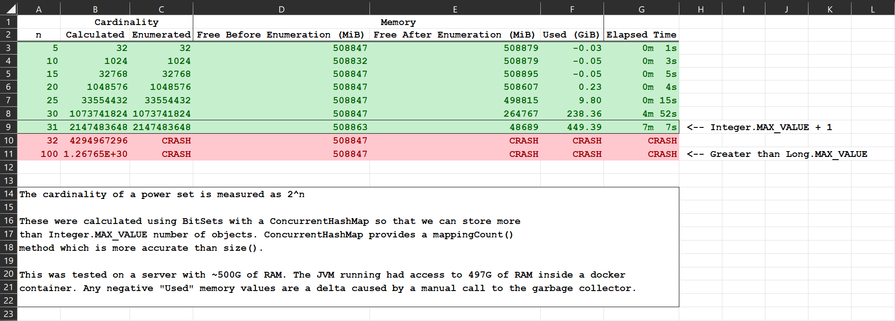

Power set Calculation Test
=========================
Playing around with power sets.

Simple calculation to test how many we can store in RAM. Fun experiment. This is not guaranteed to
be the most efficient in either time or space computations (I'd recommend using something other than
Java for that). However, this project demonstrates to others the difference between calculating the
number of permutations and enumerating those permutations. While there is room for optimization, 
such improvements will only get you so far as you start calculating larger and larger power sets.

## Build The Project

`mvn clean compile install`

## Deploy With Docker

`docker build -t powerset-test . && docker run --name powerset powerset-test`

Set number of CPUs with `--cpuset-cpus <range-of-cpus>` on the `docker run` command.
Set amount of RAM with `-m <amount-of-ram>` on the `docker run` command.
